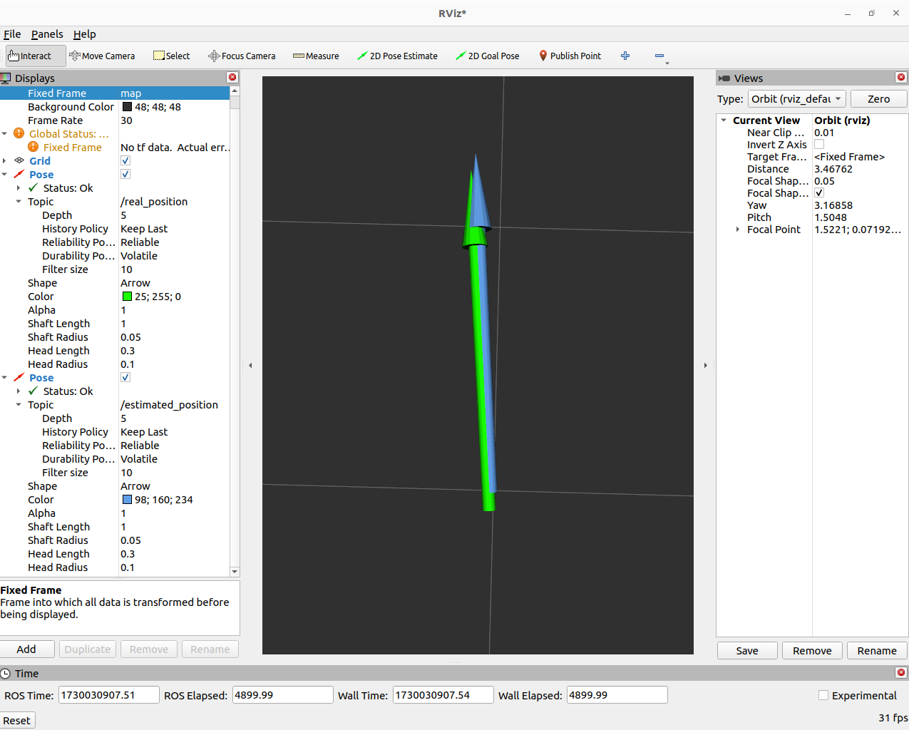

# Фильтр частиц

## Описание
Реализация фильтра частиц с интеграцией ROS2

## Установка и запуск

1. **Клонирование:**

   ```bash
   git clone https://github.com/orange3107/metro_test.git

2. **Сборка:**

   ```bash
   cd metro_test/build
   cmake ..
   make
   ```

3. **Запуск:**

   ```bash
   ./filter
   ```

## Визуализация
Скриншот из rviz с визуализацией истинного и предсказанного положения
